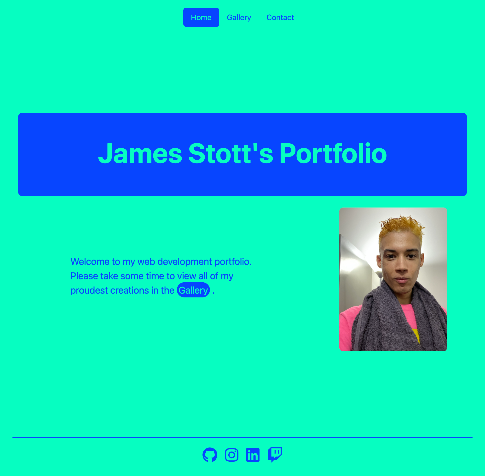

# James Stott's React Profile

## Description

This is my latest Portfolio creation. It was created using React, Bootstrap and Framer Motion and boasts a responsive and colorful design to create interest and making navigating through my gallery of development accomplishments a delight! This single page application runs smoothly, with tasteful animations and interactivity sprinkled through to demonstrate some of the wonders of web development using these modern technologies.

## Table of Contents

- [Description](#description)
- [Installation](#installation)
- [Contributing](#contributing)
- [Features](#features)
- [Questions](#questions)
- [Credits](#credits)

## Installation

This project can be used by cloning the repository git clone https://github.com/jamesaps/react-portfolio.git and can be used out of the box by running node index.js from the command line in the project directory.

## Contributing

If you would like to contribute to this project, please create a fork of it and make a Pull Request on GitHub.

## Features

- Responsive
- Animated gallery makes navigating a breeze
- Uses the latest web design technologies
  - React
  - Bootstrap
  - Framer Motion

## Questions

My GitHub username is [jamesaps](https://github.com/jamesaps). You can email me at [japstott@gmail.com](mailto:japstott@gmail.com).

## Credits

- [React](https://react.dev/)
- [Bootstrap](https://getbootstrap.com/docs/5.3/)
- [Framer Motion](https://www.framer.com/motion/)
